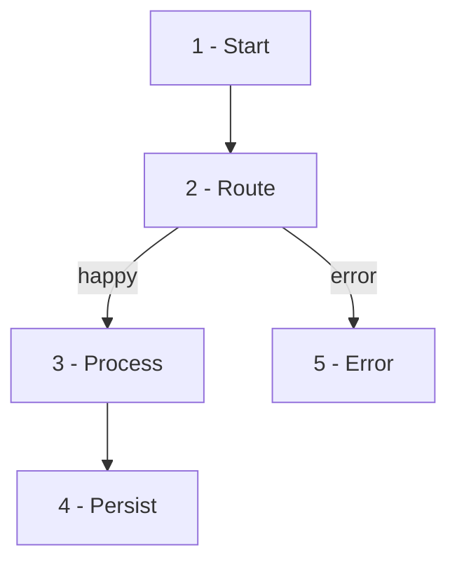
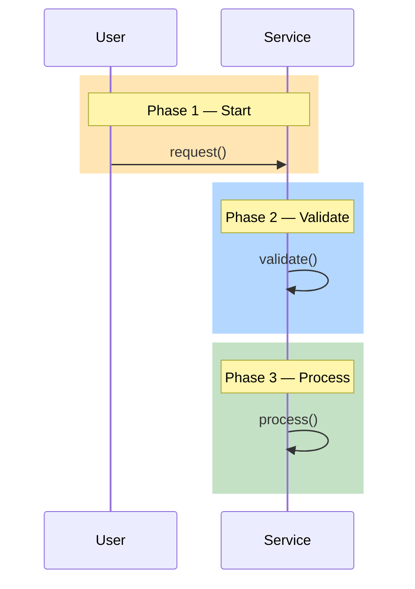

# Diagram Standards

## When to invoke

- You are creating or editing a mermaid flowchart or sequence diagram.
- A user-story doc needs sections 7 (flow) or 8 (sequence).
- You are documenting a workflow, architecture, or data flow.
- You notice a diagram in the codebase that doesn't follow these conventions.

## Flow diagram conventions

### Phase numbering

Every node in a flow diagram gets a phase number prefix:



### Color classes

Use consistent colors for each phase:

```mermaid
classDef phase1 fill:#FFE5B4,stroke:#C08B3A
classDef phase2 fill:#B4D7FF,stroke:#4A78B0
classDef phase3 fill:#C4E1C5,stroke:#4B8B4E
classDef phase4 fill:#E5C4FF,stroke:#8B5BB0
classDef phase5 fill:#FFD4D4,stroke:#B04A4A

class P1 phase1
class P2 phase2
class P3 phase3
class P4 phase4
class P5 phase5
```

| Phase | Color | Use for |
|-------|-------|---------|
| 1 | Peach (#FFE5B4) | Entry/start |
| 2 | Blue (#B4D7FF) | Routing/validation |
| 3 | Green (#C4E1C5) | Core processing |
| 4 | Purple (#E5C4FF) | Persistence/output |
| 5 | Red (#FFD4D4) | Error/exception |

## Sequence diagram conventions

### Highlight boxes match flow phases

Use `rect rgb(...)` with the same colors as the flow diagram:



### RGB values for sequence diagrams

| Phase | RGB | Notes |
|-------|-----|-------|
| 1 | rgb(255, 229, 180) | Peach |
| 2 | rgb(180, 215, 255) | Blue |
| 3 | rgb(196, 225, 197) | Green |
| 4 | rgb(229, 196, 255) | Purple |
| 5 | rgb(255, 212, 212) | Red |

## Checklist

- [ ] Every flow node has a phase number prefix (1, 2, 3...)
- [ ] Every flow node has a color class assigned
- [ ] Sequence diagram highlight boxes use matching phase colors
- [ ] Sequence diagram has `Note over` labels that match flow phase names
- [ ] Flow and sequence diagrams tell the same story

## Anti-patterns

| Don't | Do Instead |
|-------|------------|
| Unlabeled nodes | Add phase number prefix |
| Random colors | Use the standard palette |
| Flow without sequence | Pair them for clarity |
| Sequence without highlight boxes | Add `rect rgb(...)` for each phase |

## See also

- `writing-user-story` — sections 7 and 8 require these conventions.
